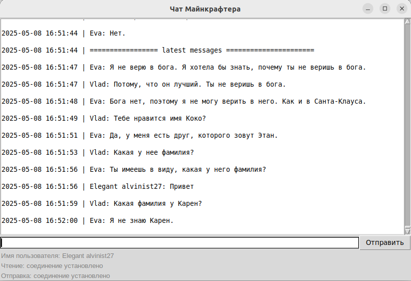

# GUI для работы с серверным чатом

Графическая оболочка для работы с подключениями к чату

Чат написан с использованием асинхронного программирования: asyncio и anyio. Графическая оболочка написана с использованием Tkinter

Для работы чата используется скрипт chat.py
Для регистрации в чате используется скрипт registration.py

## Как установить

Для работы скриптов нужен Python версии не ниже 3.6.

### Установка зависимостей:
```bash
pip install -r requirements.txt
```

### Установка пакетов для работы tkinter:
```bash
sudo apt-get install python3-tk
```


## Регистрация в чате

Для общения в чате необходимо получить серверный токен. Можно добавить его в переменную окружения / указать аргументом при запуске программы / запустить скрипт на регистрацию. 

### Окно регистрации


### Как запустить

python registration.py

Аргументы командной строки
- --write_host - адрес хоста чата
- --write_port - номер порта для прослушивания

Пример: 
usage: registration.py [-ws write_host] [-wp write_port]

## Чат:

Чат позволяет получать и отправлять сообщения, следить за подключением и переподключаться при проблемах с соединением.

### Окно чата


### Как запустить

python chat.py
Аргументы командной строки
- -ls, --listen_host - адрес хоста чата для прослушивания
- -lp, --listen_port - номер порта чата для прослушивания
- -ws, --write_host - адрес хоста чата для отправки
- -wp, --write_port - номер порта чата для отправки
- -t, --token - токен авторизации

usage: chat.py [-ls listen_host] [-lp listen_port] [-t TOKEN] [-ws write_host] [-wp write_port]

### Поддерживаются переменные окружения:
- Создайте файл .env в корне проекта. Пример представлен в .env.example:
```bash
LISTEN_SERVER_HOST="minechat.dvmn.org"
LISTEN_SERVER_PORT=5000

WRITE_SERVER_HOST="minechat.dvmn.org"
WRITE_SERVER_PORT=5050

USER_TOKEN="619497fc-1d3e-11f0-abed-0242ac110002"
```
